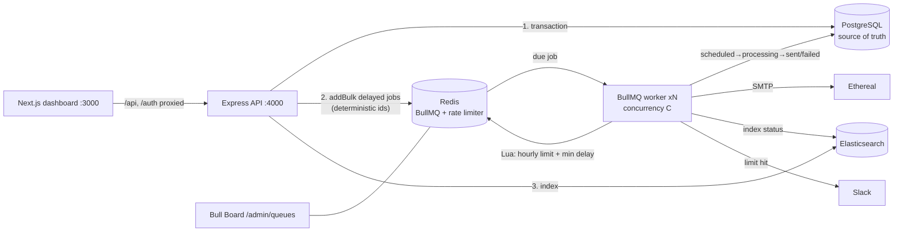

# ReachInbox — Full-stack Email Job Scheduler

A production-style email scheduler with a dashboard. Emails are stored in **PostgreSQL** and scheduled as **BullMQ delayed jobs** on **Redis** (no cron anywhere). They're sent through **Ethereal SMTP** by an idempotent worker that enforces a **distributed per-sender hourly limit** and a **minimum delay between sends**. When a limit is hit it posts a real **Slack** alert, and every email is indexed in **Elasticsearch** for search. The Next.js dashboard follows the provided Figma and uses real **Google OAuth**.

```
backend/    Express + TypeScript API, BullMQ worker, Prisma (Postgres), Elasticsearch, Slack
frontend/   Next.js 15 (App Router) + TypeScript + Tailwind v4 dashboard
samples/    leads.csv for trying the CSV upload
docker-compose.yml   Postgres 17, Redis 7 (AOF), Elasticsearch 8
```

---

## Contents
1. [Features → requirements](#1-features--requirements)
2. [Architecture](#2-architecture)
3. [Setup & running](#3-setup--running)
4. [Environment variables](#4-environment-variables)
5. [How it works](#5-how-it-works) — scheduling, restart persistence, idempotency, concurrency, delay, hourly limit, 1000+ emails, Slack, Elasticsearch, Bull Board
6. [API](#6-api)
7. [Testing](#7-testing)
8. [Demo script](#8-demo-script-5-min)
9. [Assumptions & trade-offs](#9-assumptions--trade-offs)
10. [Credits & third-party material](#10-credits--third-party-material)

---

## 1. Features → requirements

| Requirement | Implementation |
|---|---|
| Accept scheduling requests via API | `POST /api/emails/schedule` (Zod-validated, `Idempotency-Key` header) |
| Store in relational DB | PostgreSQL via Prisma: `User`, `Sender`, `Campaign`, `ScheduledEmail`, `SlackConnection` |
| BullMQ delayed jobs, **no cron** | One delayed job per email, `delay = scheduledAt - now`. No cron/node-cron/Agenda/polling |
| Multiple senders via Ethereal | Each `Sender` has its own SMTP identity; "New Ethereal sender" provisions a fresh inbox |
| Survive restarts | Jobs persist in Redis (AOF). Postgres is the source of truth. Worker start-up **reconciliation** re-creates any missing job |
| No duplicates | Unique `idempotencyKey` + deterministic job id + atomic `scheduled → processing` claim + request `Idempotency-Key` |
| Worker concurrency | `WORKER_CONCURRENCY` (BullMQ `concurrency`) |
| Min delay between sends | `MIN_EMAIL_DELAY_MS` (default **2 s**) per sender, enforced atomically in Redis across all workers |
| Emails/hour rate limit | Per **sender** per clock hour: `MAX_EMAILS_PER_HOUR` cap plus a per-campaign "Hourly Limit" (can only lower it). Redis Lua counters |
| Limit hit → reschedule, not drop | Job moved to the next available hour window. Order is preserved, spread evenly, and the DB `scheduledAt` is updated |
| Slack alert when the limit is hit | Real Slack OAuth (`incoming-webhook`, `chat:write`); one message per sender per hour window; skipped gracefully when not connected |
| Searchable via Elasticsearch | Every state change is indexed; `GET /api/emails/search` (full text, exact-email, status filter), with Postgres fallback |
| Live BullMQ dashboard | Bull Board at `http://localhost:4000/admin/queues` (login required, or optional Basic auth) |
| Google login, header with name/email/avatar, logout | Real OAuth 2.0 code flow with a verified ID token; httpOnly signed session cookie |
| Dashboard with Scheduled / Sent tabs, Compose button | Figma layout: sidebar with user card, Compose, Scheduled/Sent with live counts |
| Compose: subject, body, CSV upload + count, start time, delay, hourly limit | Full-page compose per Figma: recipient chips + `+N`, "Upload List", Send Later popover, delay and hourly limit |
| Tables with loading / empty / error states | Skeleton loaders, empty states with CTA, error + retry, toasts, pagination, auto-refresh |

Extras: email detail page (with Ethereal preview link and cancel), cancel API, search with a status filter, responsive mobile layout, `npm run load:schedule` load generator, `npm run es:reindex`.

---

## 2. Architecture



**PostgreSQL is the source of truth, Redis/BullMQ is the timer and executor, and Elasticsearch is a derived read model.** The API and the worker are separate processes (`src/server.ts`, `src/worker.ts`) that you can scale independently.

### Life of an email

```
POST /api/emails/schedule
  → Zod validation, recipient normalisation + dedupe
  → Idempotency-Key replay check (unique (userId, requestKey))
  → ONE Postgres transaction: Campaign + N ScheduledEmail rows (status=scheduled)
  → BullMQ addBulk: jobId = email_<id>, delay = scheduledAt - now
  → Elasticsearch bulk index
worker (when the delay expires)
  → load row; skip if sent/failed/cancelled (idempotent replay)
  → Redis Lua: hourly budget? min-delay slot?  → maybe re-delay / reschedule
  → UPDATE … SET status='processing' WHERE id=? AND status='scheduled'   (atomic claim)
  → SMTP via Ethereal (deterministic Message-ID)
  → status=sent (+previewUrl) | retry with backoff | failed
  → Elasticsearch update
```

---

## 3. Setup & running

### Prerequisites
- Node.js 20+ (developed on Node 24)
- Docker (for Postgres, Redis and Elasticsearch). Without Docker, see [Running without Docker](#running-without-docker).

### 1. Infrastructure
```bash
docker compose up -d        # postgres:5432, redis:6379 (AOF on), elasticsearch:9200
```

### 2. Backend (API + worker)
```bash
cd backend
npm install
cp .env.example .env
# generate secrets:
node -e "console.log('SESSION_SECRET='+require('crypto').randomBytes(48).toString('base64url'))"
node -e "console.log('ENCRYPTION_KEY='+require('crypto').randomBytes(32).toString('base64'))"
#   paste both into .env, then fill Google/Slack credentials (see below)
npx prisma migrate deploy   # creates the tables
npm run dev                 # starts API (:4000) AND worker, with reload
```
Or run them separately: `npm run dev:api` and `npm run dev:worker`. For production: `npm run build && npm start`.
You can run several workers (`npm run dev:worker` in more terminals) to see distributed limits in action.

### 3. Frontend
```bash
cd frontend
npm install
cp .env.example .env.local   # defaults point at http://localhost:4000
npm run dev                  # http://localhost:3000
```
The Next.js server proxies `/api/*` and `/auth/*` to the API, so the browser only talks to one origin.

### 4. Google OAuth (required for login)
1. <https://console.cloud.google.com/apis/credentials> → **Create credentials → OAuth client ID → Web application**. Configure the consent screen first if prompted (External, add yourself as a test user).
2. **Authorized JavaScript origins:** `http://localhost:3000`
3. **Authorized redirect URIs:** `http://localhost:4000/auth/google/callback`
4. Put the values in `backend/.env`: `GOOGLE_CLIENT_ID`, `GOOGLE_CLIENT_SECRET` (and `GOOGLE_REDIRECT_URI` if you change it). Restart the API.

If they're missing, the login page says so explicitly instead of failing silently.

### 5. Slack OAuth (for rate-limit alerts)
1. <https://api.slack.com/apps> → **Create New App → From a manifest**, pick your workspace, and paste:
   ```json
   {
     "display_information": { "name": "ReachInbox Scheduler" },
     "features": { "bot_user": { "display_name": "ReachInbox Alerts" } },
     "oauth_config": {
       "redirect_urls": ["http://localhost:4000/auth/slack/callback"],
       "scopes": { "bot": ["incoming-webhook", "chat:write"] }
     }
   }
   ```
   (Or create it from scratch: **OAuth & Permissions** → bot scopes `incoming-webhook` and `chat:write`, and the redirect URL above.)
2. **Basic Information → App Credentials** → copy the Client ID and Client Secret into `backend/.env` as `SLACK_CLIENT_ID` and `SLACK_CLIENT_SECRET`. Restart the API.
3. In the dashboard sidebar click **Connect Slack**, pick a channel, and approve. Then use **Test** to send a message.

Slack accepts `http://localhost` redirect URLs for development, so no tunnel is needed locally. For a deployed API, use its `https://…/auth/slack/callback` and set `SLACK_REDIRECT_URI`. The OAuth `state` is a signed, 10-minute token that carries the user id, so the callback also works on a different host without the session cookie. Tokens and webhook URLs are stored **AES-256-GCM encrypted**.

### 6. Ethereal
Nothing to configure. In **Compose → From → New Ethereal sender** the backend calls `nodemailer.createTestAccount()`, verifies the SMTP login, and stores the credentials encrypted. Ethereal captures the mail (it's never delivered). Every sent email gets a **preview URL** (the "Open in Ethereal" button on the email page). You can also add your own SMTP account through `POST /api/senders` with an `smtp` object.

### Running without Docker
Development for this project was done without Docker, using portable builds that match the compose file:
- **Postgres:** the [`embedded-postgres`](https://www.npmjs.com/package/embedded-postgres) npm package (same user, password and DB as the compose file)
- **Redis:** a native build, started with `redis-server --appendonly yes --maxmemory-policy noeviction`
- **Elasticsearch:** the 8.x zip, started with `-Ediscovery.type=single-node -Expack.security.enabled=false` and `ES_JAVA_OPTS=-Xms512m -Xmx512m`

---

## 4. Environment variables

`backend/.env` (validated with Zod at start-up; the process exits with a readable list of problems):

| Variable | Default | Purpose |
|---|---|---|
| `PORT` / `API_URL` | `4000` / `http://localhost:4000` | API listen port and public URL |
| `FRONTEND_URL` | `http://localhost:3000` | CORS origin and post-login redirect |
| `DATABASE_URL` | compose Postgres | Prisma connection |
| `REDIS_URL` | `redis://localhost:6379` | BullMQ and the rate limiter |
| `ELASTICSEARCH_URL` / `ELASTICSEARCH_INDEX` | `http://localhost:9200` / `emails` | Search |
| `QUEUE_NAME` | `email-send` | BullMQ queue name (tests use an isolated one) |
| `SESSION_SECRET` | — (required, ≥32 chars) | HMAC key for session cookies and OAuth state |
| `ENCRYPTION_KEY` | — (required, 32 bytes base64) | AES-256-GCM key for SMTP passwords and Slack tokens |
| `GOOGLE_CLIENT_ID` / `GOOGLE_CLIENT_SECRET` / `GOOGLE_REDIRECT_URI` | — | Google OAuth |
| `SLACK_CLIENT_ID` / `SLACK_CLIENT_SECRET` / `SLACK_REDIRECT_URI` | — | Slack OAuth |
| `WORKER_CONCURRENCY` | `5` | Parallel jobs per worker process |
| `MIN_EMAIL_DELAY_MS` | `2000` | Minimum gap between two sends **of the same sender** (all workers combined) |
| `MAX_EMAILS_PER_HOUR` | `200` | Hard per-sender cap per clock hour; a campaign's "Hourly Limit" can only lower it |
| `EMAIL_MAX_ATTEMPTS` / `EMAIL_BACKOFF_MS` | `3` / `5000` | SMTP retry policy (exponential backoff) |
| `STALE_PROCESSING_MS` | `300000` | A row stuck in `processing` this long after a crash is marked failed |
| `BULL_BOARD_USER` / `BULL_BOARD_PASSWORD` | empty | Optional HTTP Basic access to Bull Board (in addition to login) |
| `LOG_LEVEL` | `info` | pino log level |

`frontend/.env.local`: `BACKEND_URL` (proxy target) and `NEXT_PUBLIC_API_URL` (the Bull Board link).

`.env` files are git-ignored; only `.env.example` files are committed.

---

## 5. How it works

### Scheduling (no cron)
Compose sends `{senderId, subject, body, recipients[], startAt, delayMs, hourlyLimit}`. Recipients are trimmed, lowercased, validated and de-duplicated (first occurrence wins). Email *i* is planned for `startAt + i × delayMs`, which is how the compose form's **"Delay between 2 emails"** works.

Everything is written in **one transaction**, and only after the commit is each email added to BullMQ as a **delayed job** (`addBulk` in chunks of 500). Nothing polls. BullMQ keeps delayed jobs in a Redis sorted set and promotes each one when its timestamp is reached.

### Persistence & restarts
- **Redis persistence:** the compose Redis runs with `appendonly yes` (AOF, fsync every second) and `noeviction`, so pending delayed jobs survive a Redis restart. Verified: I stopped API, worker and Redis with 3 pending jobs, restarted everything, and each email was sent at its original time with `attempts=1`.
- **Worker restart:** jobs aren't held by the worker, so a new worker simply picks them up when they're due. It never starts "from day 1": completed rows are terminal in Postgres and are skipped.
- **Start-up reconciliation** (`src/worker/reconcile.ts`, runs once at boot — it is not a loop):
  1. Every `scheduled` row must have a BullMQ job. Missing ones are re-created with the **remaining** delay. This covers "API crashed between commit and enqueue" and "Redis lost data". Deterministic ids make it safe to run any number of times.
  2. Rows stuck in `processing` past `STALE_PROCESSING_MS` (the worker died *during* the SMTP call) are marked `failed` with *"delivery state unknown"* instead of being resent. See [trade-offs](#9-assumptions--trade-offs).
- **Graceful shutdown:** `SIGINT`/`SIGTERM` → `worker.close()` lets active jobs finish.

### Idempotency & duplicate protection (four layers)
1. **Request level:** the dashboard sends an `Idempotency-Key` per compose session. `(userId, requestKey)` is unique, so a retried or double-clicked submit returns the original campaign (`200, replayed: true`), even under a concurrent race (the unique-violation loser replays the winner).
2. **Row level:** `ScheduledEmail.idempotencyKey = sha256(campaignId:recipient)` is `UNIQUE`, so there's one email per recipient per campaign.
3. **Queue level:** `jobId = email_<rowId>`. Adding an existing job id is a no-op in BullMQ.
4. **Execution level:** before sending, the worker runs `UPDATE … SET status='processing' WHERE id=? AND status='scheduled'`, and only the worker whose update affected 1 row may send. Terminal rows are skipped. The SMTP `Message-ID` is derived from the idempotency key. A test fires the processor 5× concurrently at one email and sees exactly 1 send.

### Concurrency
`WORKER_CONCURRENCY` jobs run in parallel per process, and you can run any number of worker processes. Nothing is kept in memory: every decision is either an atomic Postgres conditional update or an atomic Redis Lua script. Tests cover 2 worker instances × concurrency 5 with no duplicates, and verify that the configured concurrency is actually reached but never exceeded.

### Minimum delay between sends
**Chosen: min 2 seconds between sends of the same sender** (`MIN_EMAIL_DELAY_MS=2000`). The effective gap for a campaign is `max(MIN_EMAIL_DELAY_MS, campaign delay)`.

It's enforced per sender in the same Redis Lua script:
- `grant` = the time of the last actual send permission. **Invariant: grants are always ≥ min delay apart**, across all workers.
- When a job arrives too early it **reserves the next free slot** (a FIFO `tail`), is moved back to *delayed* until that slot (`job.moveToDelayed` + `DelayedError`, which doesn't consume a retry), and sends when it wakes. 1000 simultaneous jobs therefore get 1000 distinct slots in O(n), with no thundering herd and order preserved.
- If a slot holder wakes on time but the previous send ran a few ms late, it waits the remainder **in-process** (bounded to 1 s) rather than bouncing through Redis. A holder that is far behind (e.g. after downtime) is re-queued at the tail, so a backlog can never burst.

A regression test covers the one subtle case: a late holder must not let the next holder send early.

### Hourly rate limit (per sender, distributed)
- Counter key: `rl:{senderId}:count:<hourWindow>`. It's incremented only when a send is granted, and a send needs `count < limit`. It lives in Redis, so it's shared by every worker and survives restarts. The `{senderId}` hash tag keeps all of a sender's keys in one Redis Cluster slot.
- `limit = min(campaign hourlyLimit, MAX_EMAILS_PER_HOUR)`.
- **When the limit is reached the job is rescheduled, never dropped or failed.** The Lua script hands out an **overflow position** *n* (atomic, in processing order, so ordering is preserved), and the job is moved to hour window `current + 1 + floor((n-1)/limit)` at offset `((n-1) mod limit) × (1h / limit)`. Overflow is spread evenly across future hours with at most `limit` per hour. The row's `scheduledAt` and `rescheduleCount` are updated, and the UI shows "Rescheduled".
- Slots reserved for the min delay also count against the hour's budget (`count + reserved ≥ limit`). When a burst arrives, only the jobs that can actually go this hour wait for a slot, and everything else is rescheduled **immediately**.

### Behaviour under load (1000+ emails at the same time)
Measured with `npm run load:schedule -- --user <you> --count 1000 --limit 3` (1000 emails, all due now, 3/hour):
- The API wrote 1000 rows and 1000 delayed jobs in one request (~1 s; a 10,000-recipient cap per request).
- Emails #0, #1 and #2 were sent 2 s apart. The other **997 were rescheduled right away** into later hours in order (#3 → 11:00, #4 → 11:20, #5 → 11:40, …). No job failed or was dropped.
- One Slack alert per sender per hour window, not 997.

With realistic numbers (200/hour, 2 s gap) a 1000-email burst sends 200 over the first ~7 minutes and the remaining 800 over the next 4 hours at 200/hour.

### Slack notifications
- **Connect:** `GET /auth/slack` → Slack authorize (`incoming-webhook`, `chat:write`, the user picks a channel) → `GET /auth/slack/callback` → `oauth.v2.access` → encrypted token and webhook stored in `SlackConnection` (one per user).
- **Notify:** the first overflow of a sender in an hour window wins a Redis `SET NX` flag and posts a Block Kit message (sender, limit, window, next send time). The call is fire-and-forget: a Slack failure never affects sending.
- **Not connected → no crash:** the connection is looked up on *every* notification, so connecting or disconnecting takes effect immediately without a redeploy. When nothing is connected, a single `Slack not connected; rate-limit notification skipped` log line is written.
- **Disconnect:** `DELETE /api/slack/disconnect` revokes the token (`auth.revoke`) and deletes the row. `POST /api/slack/test` sends a test message.

### Elasticsearch
- Index `emails` with explicit mappings: keyword ids, `subject` and `body` as text, and `recipient` as text + keyword + a `uax_url_email` sub-field (so an address stays one token) plus date fields.
- Indexed on create (bulk), on every state transition (processing outcome, reschedule, cancel, retry) and by `npm run es:reindex`.
- `GET /api/emails/search?q=&status=` is scoped to the user by a `term` filter. Email-shaped queries match exactly; other text uses `multi_match` over subject^3, recipient^2, body and sender, with typo tolerance for words of 5+ characters. Results are hydrated from Postgres (the source of truth) in ES rank order.
- ES is **not** in the write path's critical section: indexing errors are logged, and if ES is down, search falls back to Postgres `ILIKE` and the UI labels it as basic search.

### Bull Board
`http://localhost:4000/admin/queues` (also in the user menu as "Queue dashboard"). It's protected: you need a logged-in dashboard session, or HTTP Basic auth if `BULL_BOARD_USER`/`BULL_BOARD_PASSWORD` are set. Unauthenticated requests get `401` or a redirect to login. There you can see delayed, active, completed and failed jobs, including rescheduled delays.

### Security notes
Helmet headers, CORS locked to `FRONTEND_URL`, httpOnly + SameSite=Lax signed session cookies (HS256 via `jose`), OAuth state validation (Google: random value in an httpOnly cookie compared in constant time; Slack: signed token), secrets encrypted at rest, secrets redacted from logs, strict Zod schemas (unknown fields rejected), and per-user scoping on every query (tested: user B can't read, search or send with user A's data).

---

## 6. API

All `/api/*` routes except `/api/auth/providers` need the session cookie.

| Method | Path | Description |
|---|---|---|
| GET | `/health` | Postgres / Redis / Elasticsearch status |
| GET | `/auth/google` → `/auth/google/callback` | Google OAuth login |
| POST | `/auth/logout` | Clear the session |
| GET | `/api/auth/me` | Current user `{id, email, name, avatarUrl}` |
| GET | `/api/auth/providers` | Whether Google/Slack are configured |
| POST | `/api/emails/schedule` | Schedule a campaign. Header `Idempotency-Key` (optional). `201` created, `200` replayed |
| GET | `/api/emails/scheduled?page&pageSize` | `scheduled` + `processing`, by send time |
| GET | `/api/emails/sent?page&pageSize` | `sent` + `failed`, newest first |
| GET | `/api/emails/search?q&status&limit&offset` | Elasticsearch search |
| GET | `/api/emails/stats` | Counts per status |
| GET | `/api/emails/:id` | Email detail + campaign settings |
| POST | `/api/emails/:id/cancel` | Cancel a scheduled email |
| GET / POST | `/api/senders` | List senders (with this hour's usage) / create one (Ethereal auto-provisioned or custom SMTP) |
| GET | `/auth/slack` → `/auth/slack/callback` | Slack OAuth |
| GET | `/api/slack/status` | Connection status |
| DELETE | `/api/slack/disconnect` | Disconnect |
| POST | `/api/slack/test` | Send a test message |
| — | `/admin/queues` | Bull Board |

Example:
```bash
curl -X POST http://localhost:4000/api/emails/schedule \
  -H "Content-Type: application/json" -H "Cookie: rb_session=<cookie>" \
  -H "Idempotency-Key: 8d1c7c1e-demo" \
  -d '{"senderId":"<id>","subject":"Hi","body":"Hello!","recipients":["a@x.com","b@x.com"],
       "startAt":"2026-10-01T09:00:00Z","delayMs":2000,"hourlyLimit":50}'
```

---

## 7. Testing

The backend tests run against **real** Postgres, Redis and Elasticsearch, fully isolated from dev data: Postgres schema `test`, Redis DB 1, queue `email-send-test`, index `emails_test`. Only SMTP is replaced, by an in-memory transport.

```bash
cd backend && npm test          # 52 tests: unit + integration (≈30 s), hermetic (ignores OAuth creds in .env)
cd frontend && npm test         # 12 tests: CSV parsing
cd frontend && npm run test:e2e # 9 Playwright tests; needs API + worker + Next running (real Ethereal SMTP)
npm run typecheck && npm run lint   # both packages: strict TS, ESLint clean
```

| Area | Where |
|---|---|
| Scheduling (rows, delayed jobs, deterministic ids, delay spacing, 1200 in one request) | `backend/tests/integration/scheduler.test.ts` |
| Idempotency (same key ×3 concurrently → 1 campaign), recipient dedupe, job-id dedupe, 5 racing processors → 1 send | same |
| Retries (2 transient failures → sent, attempts=3) and permanent failure → `failed` | same |
| Concurrency (reached but ≤ configured; 2 workers × 5, no duplicates) | same |
| Min delay (grants ≥ 400 ms apart under concurrency 10) | same + `rateLimiter.test.ts` |
| Distributed hourly limit (60 concurrent calls on 2 connections → exactly 10 allowed), per sender, window rollover | `backend/tests/integration/rateLimiter.test.ts` |
| Rescheduling (overflow to later hours in order, ≤ limit per hour; burst of 1000 → 997 overflow immediately) | both |
| Slack (notify once per window; real webhook call shape; not connected → no throw; Slack error swallowed) | `scheduler.test.ts` |
| Restart persistence (stop worker → new worker sends on time; lost jobs re-created with remaining delay; stuck `processing` → failed) | `scheduler.test.ts` |
| Elasticsearch (subject/recipient/status search, exact-email vs look-alikes, typo tolerance, cancel re-indexed, per-user isolation) | `backend/tests/integration/api.test.ts` |
| API (auth required, tampered cookie, validation, Bull Board protection, helmet, OAuth state rejection) | `api.test.ts` |
| CSV parsing (header/no header, any column, quotes, `;`/tab/CRLF/BOM, `Name <email>`, dupes, invalid, 10k rows) | `frontend/src/lib/csv.test.ts` |
| E2E: login redirect, header user info, empty states, validation, creating an Ethereal sender from the dialog, CSV upload → schedule → real Ethereal send → Sent tab + preview link, search, mobile layout, logout | `frontend/e2e/dashboard.spec.ts` |

### Verified live (not just in tests)
These were run by hand against the real services, beyond what the automated tests cover:
- **Google OAuth:** real sign-in through Google's consent screen; the header shows the Google name, email and avatar.
- **Slack OAuth + alerts:** connected a workspace through **Connect Slack**. **Test** delivered a message. A campaign with hourly limit 3 sent 3 emails, rescheduled 4 into the next hour, and posted **exactly one** "Hourly send limit reached" alert to the channel.
- **Restart:** hard-killed the API and worker *and* restarted Redis with pending delayed jobs. After the restart every email was sent at its original time with `attempts=1`.
- **Load:** 1,000 emails due at once with a limit of 3/hour. 3 were sent 2 s apart and 997 were rescheduled immediately, in order, across later hours.

Google's own consent screen can't be automated, so the E2E setup signs a session cookie for a test user with the backend's `SESSION_SECRET` (`backend/tests/helpers/testUser.ts`). The app itself has no non-Google login.

---

## 8. Demo script (≤ 5 min)

**Recorded demo (4:16, narrated):** [`docs/demo.mp4`](docs/demo.mp4). It was recorded against the live stack as a real Google user, with a real Slack workspace and real Ethereal SMTP. It shows:
Google login → compose with an Ethereal sender and CSV upload → Scheduled → Bull Board → sends spaced by the min delay → hourly limit hit, overflow rescheduled and a Slack alert posted → a full API + worker stop and restart with emails still sent on time, exactly once → 1,000 emails in one request → Elasticsearch search.

How it's produced (reproducible): `frontend/scripts/record-demo.mjs` drives Playwright against a separate demo namespace (its own DB, queue and index) and times each scene to a narration clip. The narration comes from `frontend/scripts/demo/narration.json`, voiced with Windows TTS by `frontend/scripts/demo/tts.ps1`. ffmpeg then muxes an H.264/AAC MP4.

To present it yourself:

1. `docker compose up -d`, `cd backend && npm run dev`, `cd frontend && npm run dev`. Open <http://localhost:3000>. **Login with Google** → the dashboard shows name, email and avatar.
2. **Connect Slack** (sidebar) → approve → **Test** → a message appears in the channel.
3. **Compose** → From: *New Ethereal sender* → **Upload List** with `samples/leads.csv` (shows *7 emails detected, 1 duplicate removed, 1 invalid skipped*). Subject and body; delay `5`, hourly limit `3`. **Send**.
4. **Scheduled** tab: rows with orange time pills. Open Bull Board (user menu → *Queue dashboard*): delayed jobs.
5. Watch **Sent**: 3 emails arrive ~5 s apart. Open one → **Open in Ethereal**. The other 4 move to the next hours (**Rescheduled**), and a **Slack alert** arrives once.
6. **Restart:** compose 3 emails with *Send Later* ~1 minute ahead → stop the backend (Ctrl+C) → wait → `npm run dev` again → they're sent at their original time, exactly once.
7. **Load (bonus):** `npm run load:schedule -- --user <your-email> --count 1000 --limit 20` → Bull Board shows ~1000 delayed jobs, 20 sent this hour 2 s apart, the rest spread across the following hours.
8. **Search:** type a recipient or a word from the subject in the search bar (Elasticsearch).

---

## 9. Assumptions & trade-offs

- **Limit scope:** the hourly limit and min delay are **per sender** (SMTP providers throttle per mailbox). `MAX_EMAILS_PER_HOUR` is a global per-sender ceiling, and a campaign's hourly limit can only lower it. Two campaigns on one sender share the counter; each checks it against its own limit.
- **Hour windows are clock hours (UTC)**, not a sliding 60 minutes. That's simpler, cheap, and easy to explain in alerts. The downside is a possible 2× burst across an hour boundary, which the min delay mitigates.
- **"Min delay" is measured between send starts** (permission grants), which Redis guarantees across workers. Completion times vary with SMTP latency.
- **Crash during the SMTP call:** delivery state is unknown, so the row becomes `failed` ("delivery state unknown") rather than being retried automatically. This favours *at-most-once* (no duplicates, as the brief demands) over *at-least-once*. The window is only the SMTP round-trip. Every other failure mode is retried or recovered.
- **A rate-limit slot is consumed at grant time.** If SMTP then fails, that slot still counts. This is conservative, and providers count attempts too.
- **Reconciliation runs at worker start-up only** (no polling, per the constraint). If Redis is down when the API commits, the API returns `503` and the rows are queued by the next worker start.
- **Elasticsearch is eventually consistent** with Postgres. Writes never fail because of ES, and `npm run es:reindex` rebuilds the index.
- **Email/password fields** on the Figma login card are shown disabled with a note. Only real Google login is supported, as required.
- **Figma access:** the file couldn't be opened through the Figma API (no edit access, and the file asks not to request it), so the UI was matched from the rendered frames (login, scheduled, sent, detail, and the three compose states). Colours and spacing are approximations of the design tokens.
- **Body is plain text** (rendered to escaped HTML for the email). The Figma's rich-text toolbar wasn't implemented, to avoid shipping non-functional buttons.
- **Session:** a stateless signed cookie (7 days); logout clears it. Server-side revocation would need a session store.
- **Recipients per request** are capped at 10,000 to bound one transaction. Bigger lists can be split client-side.

---

## 10. Credits & third-party material

The application code in this repository was written for this assignment and is not copied from other projects. The following material comes from elsewhere and is used under its own terms:

| Material | Source | Terms / use |
|---|---|---|
| UI design (layout, colours, "ONB" wordmark, screens) | Outbox Labs assignment Figma | Provided as the spec for this assignment |
| Google "G" mark on the login button | Google Sign-In branding | Used as intended for a "Login with Google" button |
| Slack logo in the Slack panel | Slack brand assets | Used to identify the Slack integration |
| Inter, Space Mono fonts | Google Fonts via `next/font` | SIL Open Font License |
| Icons | [lucide-react](https://lucide.dev) | ISC |
| npm dependencies (Express, BullMQ, Prisma, Next.js, …) | npm | All permissive: MIT, Apache-2.0, ISC, BSD-2-Clause, MIT-0 |
| `samples/leads.csv` | Invented for testing | Fictional addresses |
| Demo voice-over | Windows built-in text-to-speech (OneCore "Mark" voice) | Generated locally from `frontend/scripts/demo/narration.json` |
